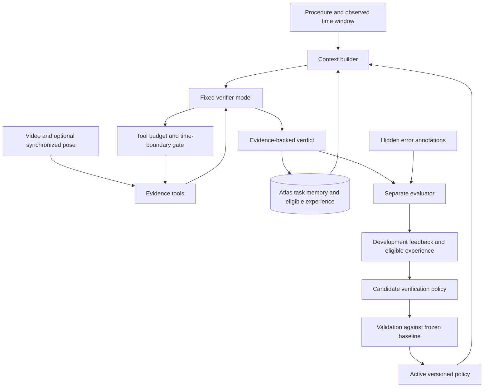

# Robologue

*a dialogue for robots*

## Integrated IndustReal runtime

This branch connects real RGB inspection, durable Atlas memory, a component
verifier, and the hidden-label evaluator. Run `robologue run-dataset` for the
budgeted workflow. See [implementation and commands](docs/INTEGRATION.md) and
[audit results](docs/AUDIT_RESULTS.md). Real visual accuracy remains pending
the vision API key; media and persistence checks are complete.


A hackathon starter for a persistent procedural-memory harness, evaluated on
CaptainCook4D egocentric recordings. The goal is to remember unresolved mistakes
through a long task and improve which evidence an agent checks before advancing.

**Status:** runnable memory plumbing, a synthetic observation replay, optional
MongoDB Atlas persistence, a CaptainCook4D evaluation-label converter, an
IndustReal label adapter, a hidden-label four-outcome scorer, and a tested
single-rule policy promotion gate. There is no video model, trained error
detector, or real-data benchmark result yet. The bundled decisions are deterministic.

## Why CaptainCook4D?

It provides real procedural-activity recordings, annotations, error categories,
and task graphs. Some errors were deliberately induced during collection;
real footage does not imply every mistake occurred naturally. This project tests
procedural memory, not robot motor control or demonstrated sim-to-real transfer.

- [Dataset and video downloader](https://captaincook4d.github.io/captain-cook/)
- [Official annotations](https://github.com/CaptainCook4D/annotations)
- [Annotation schema](https://github.com/CaptainCook4D/annotations/blob/main/ANNOTATIONS.md)
- [Task graphs](https://github.com/CaptainCook4D/annotations/tree/main/task_graphs)

### Sensor data and dataset decision

CaptainCook4D is not video-only. The [official downloader](https://github.com/CaptainCook4D/downloader)
documents a `spatial` stream containing head and hand pose, plus camera pose,
depth, audio, and accelerometer/gyroscope/magnetometer streams. The paper's data
composition table lists left and right wrist poses. These are human/device
measurements, not robot joint commands. Verify an actual spatial file before
promising full finger-joint positions, joint angles, or a specific coordinate layout.

Coverage is incomplete: the downloader notes that some recordings have only
GoPro footage and others lack spatial/IMU data. Synchronized streams are described
as aligned with GoPro; raw streams retain device timestamps. Inspect timestamps,
coordinate frames, missing values, and tracking validity in the selected files.
Device IMU motion is not a direct measure of hand or object motion.

**Recommendation: keep CaptainCook4D for the current procedural-memory MVP.**
Select one task family with a few complete recordings and check RGB + spatial coverage.
Use RGB plus a small motion summary if the spatial stream is usable. A lack of
tracking is unknown evidence, not an error or proof of no motion. Pose should help
choose when/what to inspect; it cannot independently prove successful execution.

[IndustReal](https://github.com/TimSchoonbeek/IndustReal) is the alternative if
explicit hand-joint tracking and assembly are central. Its README documents
`hands.csv`, gaze and head tracking at 10 FPS, RGB/depth, and assembly error labels.
This is still human tracking, not robot actuation. Prefer the switch only if a
small usable subset can be opened promptly; do not spend the build comparing
entire datasets. The existing checkpoint/replay core is dataset-independent,
while the label converter currently supports CaptainCook4D only.

## Target architecture: budgeted verification with persistent memory

**One-line pitch:** an agent that learns what evidence to inspect before declaring
an embodied task step successful. It remembers prior failures and improves its
verification policy while keeping the underlying models fixed.

This section describes the target system, not features already implemented. The
current code provides deterministic replay, persistence, and label preparation.
Video inspection, model-driven tool calls, budgets, Vector Search, structured
verdicts, and automatic policy selection remain to be built.



The feedback branch operates between development runs. Validation chooses a policy;
a final untouched test set measures it. Test labels never flow into agent memory,
experience retrieval, rule generation, or model context.

### 1. What the verifier starts with

A compact context packet for each step/window, for example:

```yaml
recording_id: illustrative-recording
step: Whisk batter
observed_window_seconds: [412, 440]
observed_until_seconds: 440
instruction: Whisk the batter until smooth.
prerequisites: [add eggs, add flour]
task_state:
  verified_steps: [add flour, add eggs]
  open_issues: []
motion_summary: null  # Populate only from a validated sensor adapter.
active_policy: verification-v1
active_rules:
  - Inspect the utensil and visible result before accepting this step.
budget_remaining:
  video_inspections: 2
  total_tool_calls: 5
```

These times, rules, and budgets are illustrative, not dataset-derived findings.
Distinguish observed actions from verified completion and attach evidence to both.
Load prerequisites from task instructions/task graphs, not the held-out episode's
error annotations. Filter context to the current task and relevant dependencies.

For the quickest MVP, known step boundaries may be supplied without error labels;
call this **verification of pre-segmented steps**. Fixed chronological windows are
the alternative. Neither setup demonstrates automatic online step localization.
The agent cannot inspect frames later than `observed_until_seconds`. Missing-step
labels with no interval remain evaluator-only; do not invent observations for them.

### 2. Tools and their contracts

The verifier receives summaries. Raw frames go to the vision-language model inside
`inspect_video`; raw pose arrays go to numerical feature extraction. Tool results
return evidence IDs, provenance, uncertainty, and availability.

| Tool | Result | Important boundary |
| --- | --- | --- |
| `inspect_video(t_start, t_end, n)` | VLM observations from selected frames, frame references, ambiguity | The VLM sees frames and neutral task context, never error labels or answer-bearing filenames; no future frames |
| `get_hand_summary(t_start, t_end)` | Implemented motion features and tracking coverage | Check schema/units/time alignment first; unavailable tracking is not zero motion |
| `check_prerequisite(step)` | Verified/unverified/contradicted status with source evidence | A recorded action name alone does not establish successful completion |
| `search_experience(query)` | Similar eligible development cases with outcomes and evidence | Filter by split, task relevance, run cutoff, and source recording before semantic retrieval; exclude the current recording |
| `get_rules(step_type)` | Applicable rules from the pinned policy version | No mid-run policy mutation; each rule has scope and provenance |

If using the earlier name `get_frames`, treat it as the internal sampler behind
`inspect_video`, not as a second path that exposes labels or bypasses the budget.

**Enforce costs in code.** Reserve the available call budget before execution,
limit video frames and retries, charge attempted calls, and log latency/token use.
A prompt asking the model to be economical is not budget enforcement. If evidence
remains insufficient when the budget is exhausted, allow abstention rather than
forcing a success/failure guess. Pin tool schemas, model versions, and policy for
an entire run. The starter currently implements none of these tool gates.

### 3. Evidence collection and verdict

Illustrative sequence:

1. A motion summary suggests hand activity, which does not prove correct whisking.
2. The verifier calls `inspect_video(430, 440, 3)`; the VLM reports a tablespoon.
3. It retrieves relevant development experiences and checks the procedure's tool
   requirement and visible outcome.
4. If the procedure actually requires a whisk and reliable evidence contradicts
   it, the verifier can predict a preparation error. Similar cases alone are not
   sufficient proof. If the requirement or outcome is ambiguous, it abstains.

Target verdict schema (separate from the current CLI's simple decision output):

```json
{
  "recording_id": "illustrative-recording",
  "step": "Whisk batter",
  "verdict": "insufficient_evidence",
  "error_type": null,
  "confidence": null,
  "reason": "A spoon was observed, but the required utensil and batter outcome remain unclear.",
  "evidence_ids": ["inspection-01", "motion-window-412-440"],
  "tools_used": ["inspect_video", "search_experience"],
  "rules_applied": ["check-tool-and-result-v1"],
  "policy_version": "verification-v1"
}
```

Allowed verdicts: `correct`, `incorrect`, `insufficient_evidence`. Normalize
`error_type` to the published dataset taxonomy only when supported. Any model
confidence is an uncalibrated estimate until checked; permit null rather than
inventing a probability. Require valid evidence IDs and validate output structure
before persistence. Save concise decision rationales and observations, not private
chain-of-thought. An issue remains open until new evidence supports its resolution.

### 4. Atlas memory and trace storage

Target logical collections; currently only the `sessions` checkpoint is implemented:

| Collection | Purpose |
| --- | --- |
| `sessions` | Current task state, open issues, verified steps, checkpoint and pinned policy |
| `observations` | Timestamped perception outputs and references to source evidence |
| `tool_traces` | Observable context, tool calls/results, costs, next context and verdict |
| `experiences` | Eligible development cases with revealed outcomes, embeddings and source split |
| `policy_versions` | Rule scopes, candidate changes, validation results and active version |
| `evaluation_results` | Hidden-label scores, run configuration and dataset split; evaluator-only access |

Use separate evaluator permissions or a database unavailable to agent tools.
Storing labels in a different collection is not sufficient if the agent can run
arbitrary database queries. Supply narrowly scoped tools instead. Persist memory
and the run cursor so a process restart does not silently reset outstanding issues.

### 5. Policy improvement outside the verifier

- **Development:** reveal outcomes after prediction; save eligible experience and
  collect misses/false alarms. Propose a small rule change grounded in those cases.
- **Validation:** compare candidate and current policy under equal budgets, the same
  underlying models, and fixed eligible experience. Validation labels score/select
  candidates but are not retrieved as cases or used for rule-writing prompts.
- **Promotion:** accept only under criteria set before the run, retain the previous
  version, and support rollback. Pin the chosen version for the next run.
- **Final test:** freeze rules and experience eligibility; report unseen-recording
  results with no label-driven updates.

For an MVP, prioritize lower missed-error rate subject to fixed false-alarm and
cost limits. Also report abstention rate and coverage; replacing every prediction
with `insufficient_evidence` must not count as improvement. Use a small fixed
candidate budget to reduce validation overfitting. With tiny samples, report counts
and limitations rather than claiming broad statistical superiority.

Self-improvement here means changing verification rules/tool selection/context
policies. It is not model fine-tuning or an RL implementation. The demo compares
policy versions with the same models and reports actual outcomes, including any
failure to improve.

## Why a memory harness first, and how it relates to RL

**Our rationale:** reuse a pretrained model's capabilities and a small amount of
verified task experience to adapt evidence collection at inference time. This is
practical within the hackathon and produces inspectable, reversible changes. We
are testing whether it works, not asserting that it always beats learned policies.

Avoid saying "RL requires a labeled dataset and our system needs no data." Online
RL can generate experience by interacting with an environment; offline RL learns
from existing interaction data. Both require a learning objective and useful
experience. Our harness also relies on pretrained models, observations, and reliable
feedback to validate its proposed improvements. Memory and RL can be combined.

| Consideration | This memory-harness MVP | A later learned verification policy |
| --- | --- | --- |
| Adaptation | Retrieve experience and update explicit verification rules | Train policy parameters from outcomes |
| Immediate requirement | Existing models, useful observations, limited verified development feedback | A suitable training setup, rewards, compute, and adequate action/outcome coverage |
| Strength to test | Fast, inspectable updates and persistent task context | More efficient or consistent tool selection after training |
| Limitation | Retrieval mistakes, context cost, and brittle or overfit rules | Reward design, distribution shift, exploration/data coverage and training cost |

The immediate obstacle is not simply "no data": egocentric recordings contain
human actions, but do not provide the counterfactual outcome of a robot action our
agent invents. We can execute and evaluate evidence-gathering tool calls against
recordings. We cannot use those recordings to validate arbitrary physical recovery.

### Using our traces for future learning

Yes: the harness can collect data for learning **which verification tool to call
next, when to stop, and when to abstain**. Log complete externally observable
trajectories, not just verdicts or retrieved error labels:

```text
(context/history snapshot, action and arguments, returned evidence,
 next context/history snapshot, measured cost, eventual verified outcome, terminal flag)
```

Include source recording/split, model/tool/policy versions, timestamps, available
actions, and budget. This is a partially observed problem: retain relevant history
rather than assuming the latest summary is a complete state. Preserve actual
sampling probabilities if exposed by the behavior policy; never fabricate them.

Potential routes after collecting and checking enough data:

1. **Supervised imitation:** train a smaller selector on independently validated
   useful tool choices. This may be simpler than RL as a first training step.
2. **Preference learning:** compare better/worse evidence-gathering sequences for
   the same task under the same budget.
3. **Offline RL:** use logged actions, observations, costs and reward-bearing
   outcomes to learn tool selection, with attention to limited action coverage.
4. **Online RL in a replay environment:** allow a learner to choose inspections
   of permitted recorded evidence and score its final verdict and tool cost.

An illustrative reward can credit correct verdicts and penalize missed errors,
false alarms, and tool cost, with an explicit abstention policy. Choose weights
before final evaluation; a VLM's self-reported confidence is not ground-truth reward.
A narrow deterministic policy produces biased, limited traces, so logs alone do
not guarantee a useful RL dataset. Retain untouched test recordings for assessment.

These are verification-agent training data, **not robot motor-control trajectories**.
Training physical recovery/control would need robot actions, state transitions,
and measured real/simulated outcomes, plus validation on the target embodiment.

References: [RL interaction and rewards](https://spinningup.openai.com/en/latest/spinningup/rl_intro.html),
[offline RL and its data limitations](https://arxiv.org/abs/2005.01643).

## Run the synthetic starter

Python 3.10+; local mode needs no dependencies or API keys. Run from this directory:

```bash
python3 -m robologue.cli replay examples/observations.jsonl --session demo-memory --limit 2
# Start a new process and resume; already applied events are skipped.
python3 -m robologue.cli replay examples/observations.jsonl --session demo-memory
# Same observations, but no semantic memory between events.
python3 -m robologue.cli replay examples/observations.jsonl --session demo-stateless --mode stateless
python3 -m unittest discover -s tests -v
```

Expected: memory mode keeps the utensil issue open at events 2 and 3, then clears
it at event 4. Stateless mode forgets the earlier issue at event 2. This is an
explicitly authored plumbing fixture, **not evidence of model improvement**.
The `issue`, `resolves`, and `completed_steps` fields are perception outputs in the
future system; in this fixture they are hand-authored. Resolution claims are
trusted by the starter and need evidence validation in the real system.

Local checkpoints live in `work/memory.sqlite`. To rerun from scratch, choose a
new session name. Use a different session for every recording, mode, and experiment.

## Use the hackathon Atlas Sandbox

```bash
python3 -m venv .venv
source .venv/bin/activate
python -m pip install -e '.[atlas]'
# Export MONGODB_URI using your provided Sandbox credentials.
export MONGODB_DATABASE=robologue
python -m robologue.cli replay examples/observations.jsonl --session atlas-demo --backend atlas
```

`.env.example` documents variables; this code does not load `.env` automatically.
Never commit credentials. Local mode is only for development; the submitted
project must use the provided hackathon Atlas Sandbox.

The `sessions` collection stores one atomic checkpoint document per session.
One worker per session is supported. Concurrent writers need optimistic locking.
Only five recent observations enter the retained context, but receipt IDs and task
state still grow. Long deployments need separate event storage, compaction, and
MongoDB document-size handling. This is not a billion-token implementation.
No database provisioning, credentials, or live Atlas connection is bundled.

## Prepare real evaluation labels

Download `annotation_json/error_annotations.json` from the official annotation
repository into `data/`, then run:

```bash
python3 -m robologue.cli prepare-labels data/error_annotations.json --output work/evaluation-labels.jsonl
```

The converter follows the published recording/step schema. It preserves repeated
step IDs using unique annotation IDs. Missing steps can have `-1` timestamps;
these become untimed evaluator records, never observations at the start of a video.
The output must not already exist, to avoid accidental overwriting.

For IndustReal, `robologue/industreal_labels.py` reads the official headerless
`PSR_labels_raw.csv` together with `procedure_info.json` and emits evaluator-only
records keyed by recording, component, and frame. Labels map `-1` to incorrect,
`0` to not_completed, and `1` to correct. Malformed identities and inconsistent
component widths are rejected; unmatched checkpoints are excluded and reported,
never forward-filled or matched across recordings.

**Do not generate observed actions from annotation descriptions.** These can state
the expected instruction rather than what actually happened. In particular,
`errors`, `has_errors`, `is_error`, and `modified_description` are hidden labels.
The replay schema rejects unexpected fields, but cannot detect answers copied into
free-text observations. Keep evaluator files outside the agent's retrieval/tools.

Use fixed chronological video windows initially. Produce observations from video,
then replay the generated JSONL using the same command as above. Do not expose
future frames, error-marked boundaries, or test annotations to the agent. Missing
steps may be scoreable only after a prerequisite deadline or the recording ends.

## Run the evaluation pipeline

The `evaluate` command wires the Person 3 modules end to end: it loads
IndustReal-format labels, scores a verdict file, proposes a checklist rule from
false-corrects, and, given a second verdict file from a candidate policy run,
decides promotion under a call budget. It scores verdict *files*; it does not
run a verifier or look at video.

```bash
python3 -m robologue.cli evaluate examples/eval-synthetic/PSR_labels_raw.csv \
  examples/eval-synthetic/baseline-verdicts.jsonl --recording rec-SYN \
  --candidate-verdicts examples/eval-synthetic/candidate-verdicts.jsonl \
  --policy-id checklist-v2 --parent-policy-id baseline-v1 --budget 24 \
  --output work/eval-report.json
```

The synthetic fixtures show the intended shape: baseline scores 0.800 accuracy
with 2 false-corrects, the candidate holds 0.800 with 0 false-corrects, and the
promotion gate accepts with reasons. Point the command at real label files and
real verifier verdicts for the actual experiment.

## Close the loop: run with the promoted policy

A promoted policy changes runtime behavior. Pass the frozen policy (a bare
record, or an `evaluate --output` report holding one) to `replay`:

```bash
python3 -m robologue.cli replay examples/observations.jsonl --session demo \
  --db work/memory.sqlite --policy work/eval-report.json
```

Only an `accepted` policy may run; anything else is rejected. Its checklist
rides on every `request_verification` decision as `verification_checklist`,
telling the verifier what evidence to require before an issue clears. This is
the self-improvement loop running: score, propose, promote, load, verify
against the new checklist.

## Observation contract

One JSON object per line:

```json
{
  "event_id": "recording-window-001",
  "recording_id": "recording-id",
  "timestamp": 10.0,
  "observation": "Description of evidence visible up to this timestamp",
  "completed_steps": [],
  "issue": {"id": "stable-issue-id", "description": "Unresolved concern grounded in observations"},
  "resolves": []
}
```

`issue`, `completed_steps`, and `resolves` are optional. Times must be finite,
nonnegative, and chronological. An event ID cannot be reused with changed content.
Task graphs describe dependencies; do not assume every task has a strict linear
order. The starter does not yet parse or enforce the official graphs.

## Four-person plan: five to six hours

Keep one task family and one end-to-end demo. Four people let us separate
sensor work, harness work, evaluation, and the demo rather than expand the scope.

| Owner | Workstream | Concrete handoff |
| --- | --- | --- |
| Person 1 | Data + perception | Select/download a tiny recording subset; inspect spatial schema and alignment; produce chronological observation JSONL from RGB and optional motion summaries |
| Person 2 | Harness + Atlas | Persist task memory in the provided Sandbox; add evidence-based verification decisions and bounded retrieval; prove restart recovery |
| Person 3 | Evaluation + adaptation | Keep labels isolated; define whole-recording splits; compare fixed-model baselines; propose and validate one bounded policy change (scorer and promotion gate implemented in `robologue/evaluate.py` and `robologue/policies.py`) |
| Person 4 | Replay UI + integration + submission | Connect the event/decision stream to a minimal recording replay; show evidence and unresolved issues; own integration checks, README, video, and submission |

### Shared interfaces

- Person 1 produces the existing observation JSONL contract. Summarize optional
  sensor evidence in `observation` initially; do not add unknown schema fields.
- Person 2 consumes observations and returns decisions containing `event_id`,
  `timestamp`, `action`, `open_issues`, and `completed_steps`.
- Person 3 alone handles evaluation labels and produces aggregate metrics. No
  current test label or error description enters perception or agent context.
- Person 4 displays predictions as predictions and clearly labels synthetic
  fixtures. Use sample events while the real-data adapter is being built.

### Schedule and scope gates

| Elapsed | Shared milestone |
| --- | --- |
| 0-30 min | Freeze interfaces and one task; Person 1 opens a real recording and matching sensor/label files; others use the synthetic fixture |
| 30-120 min | Work independently: observation adapter, Atlas harness, evaluator, replay UI |
| 2-3 hours | Integrate one real recording end to end and restart midway |
| 3-4 hours | Evaluate separate recordings with identical perception outputs and model settings |
| 4-5 hours | Add one tested verification-policy change only if the core works; otherwise fix failure cases |
| Final 30-60 min | Freeze features, record the one-minute demo, verify public repo/demo access, and submit |

At 30 minutes, if spatial data cannot be opened/aligned, proceed RGB-first on
CaptainCook4D; do not silently present generated tracking as captured sensor data.
If detailed hand joints are essential and an IndustReal subset is already usable,
make one dataset switch then and freeze it. No model training, robot control,
full-dataset downloads, or second task family in this time budget.

For recursive harnessing, propose one check such as requiring explicit prerequisite
evidence after repeated order-related errors. Propose from development feedback,
select on validation recordings, then freeze the policy before final testing. Never weaken the evaluator to improve
the score. Keep the underlying model fixed when measuring harness improvements.

## Evaluation and honest claims

First compare identical perception outputs with and without memory. If pose is
added, separately compare RGB-only and RGB-plus-pose with the same harness, so
sensor improvements are not attributed to memory. Split by complete
recording (preferably by participant/environment), not frames. Ground-truth labels
can inform development feedback, but final evaluation labels never enter memory.

Report missed errors, false alarms, decision latency, model calls, and whether
issues survive restart. Include normal steps; predicting an error everywhere is
not useful. Evaluate error detection separately from intervention/recovery:
recordings cannot establish what an unexecuted correction would have caused.

The core demo should show persistent task state and changing verification behavior.
An image classifier or basic retrieval UI alone would not satisfy the intended
harness contribution and risks the event's prohibited-project categories.

## Code map

- `robologue/harness.py`: validated replay, idempotency, issue memory, stateless baseline; loads an accepted policy and attaches its checklist to verification requests.
- `robologue/store.py`: local SQLite or Atlas single-document checkpoints.
- `robologue/captaincook.py`: evaluator-only annotation conversion.
- `robologue/industreal_labels.py`: IndustReal PSR label adapter producing evaluator-only records.
- `robologue/evaluate.py`: hidden-label four-outcome scoring (`correct` / `incorrect` /
  `not_completed` / `insufficient_evidence`) with exact-identity joins; abstentions never count as correct.
- `robologue/policies.py`: proposes at most one checklist rule from real development misses;
  promotion requires fewer false-corrects, no accuracy drop, and a respected call budget.
- `robologue/cli.py`: CLI entry points (`replay`, `prepare-labels`, `evaluate`).
- `examples/observations.jsonl`: original synthetic fixture, not CaptainCook4D data.
- `examples/eval-synthetic/`: hand-authored IndustReal-shaped fixtures (NOT real
  recordings) for the `evaluate` command: `PSR_labels_raw.csv`, baseline verdicts
  with two false approvals, and candidate verdicts with those approvals abstained.
- `tests/test_core.py`: restart, leakage-boundary, ordering, and missing-step checks.
- `tests/test_evaluation.py`: 37 tests for the label adapter, scorer, and policy promotion gates.
- `tests/test_evaluate_cli.py`: 3 tests for the end-to-end `evaluate` command.

## Attribution and original work

CaptainCook4D recordings/annotations are external research inputs; follow their
published terms and cite Peddi et al., *CaptainCook4D: A Dataset for Understanding
Errors in Procedural Activities*, NeurIPS 2024. The project site states Apache 2.0
for the dataset; check terms accompanying each downloaded asset.

All starter application code and the synthetic fixture were created for this
hackathon. No third-party application implementation or dataset is vendored here.
Clearly distinguish external models, libraries, and data from the harness your
team builds during the event. Do not present existing research results as ours.
