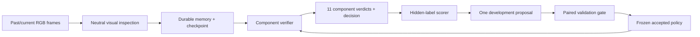

# Integrated RGB, memory and evaluation pipeline

## Status

Integration branch: `codex/integrated-video-evaluation`, based on main `c0b489c`.
Reviewed Person 1 `a7f900d` and Person 2 `d1f5eac`.
Main's package rebrand removed the perception and durable runtime modules.
This branch ports those modules into `robologue`, preserving main's evaluator
and promoted-policy support, and adds the actual component verifier and dataset runner.

**Completed:** archive preparation, full video decode audit, native RGB/video
alignment, offline integration tests, and live Atlas persistence/restart checks.
**Pending:** real model inference and measured visual accuracy. The supplied
Person 2 environment file contains Atlas credentials but no `OPENROUTER_API_KEY`.
Paid model calls so far: **0**. Authorized experiment cap: **$10**.

## Pipeline and ownership



| Owner | Implemented handoff |
|---|---|
| Person 1 | Numeric source frame IDs, content hashes, at most three frames, neutral observations and uncertainties |
| Person 2 | Atlas/SQLite evidence, bounded recent memory, immutable run config, receipt/outbox recovery, model spending ledger, verifier orchestration |
| Person 3 | Exact component/frame scoring, duplicate rejection, confusion matrix, one dev-derived rule, paired promotion gate |
| Person 4 | JSONL decisions and verdicts, JSON/HTML report, CLI orchestration suitable for replay UI integration |

The current verifier uses the fixed `google/gemini-2.5-flash` model through
OpenRouter. This experiment compares harness behavior with the model held fixed.
It does not train JEPA, JEV, or Hermes. Choosing or training a learned policy
requires a separate experiment with appropriate training data.

## Input

- RGB source images in a native recording folder.
- Verified numeric frame-to-decoded-video-PTS mapping.
- Public descriptions of 11 assembly components from IndustReal procedure metadata.
- Evaluator-selected numeric checkpoint frames, in chronological order.
- In memory mode, the previous three model-generated checkpoint summaries.
- An immutable accepted checklist policy, if validation promoted one.

No recording/trial names, file paths, action annotations, PSR state values,
hidden error descriptions, depth or object-detection annotations enter model prompts.
Images are encoded as JPEG, with a maximum dimension of 768 pixels.
Each checkpoint inspects its current frame and up to two earlier frames in the
preceding 50-frame window. Sparse frames cannot establish continuous motion.

The evaluator derives the checkpoint schedule from annotation frame IDs.
This measures verification at supplied checkpoints, not autonomous discovery
of when an agent should inspect a recording.

## Output

Every checkpoint produces:

1. An immutable neutral inspection packet, including frame IDs and hashes.
2. One verdict per component: `correct`, `incorrect`, `not_completed`, or
   `insufficient_evidence`, with a short rationale and cited frame IDs.
3. A durable harness decision: `request_verification` when the model reports
   an incorrect or uncertain component; otherwise `continue_observing`.
4. Recent memory and an idempotent receipt.

A verdict cannot approve current assembly using only older-frame citations.
Normal unfinished work is `not_completed`; uncertainty is an abstention.
Assembly state can change or be removed, so historical correctness is never
stored as permanently completed assembly.

Evaluation artifacts:

| File | Contents |
|---|---|
| `protocol.json` | Frozen splits, public component catalog and checkpoint schedule |
| `development.jsonl`, `validation.jsonl`, `heldout-baseline.jsonl` | Baseline memory verdicts |
| `stateless.jsonl` | Same RGB evidence with no previous checkpoint memory |
| `candidate-validation.jsonl` | Candidate run, when development has eligible misses |
| `selection.json` | Proposed rule, validation decision and frozen policy |
| `heldout-selected.jsonl` | Accepted-policy heldout run, when a rule was accepted |
| `memory-baseline.jsonl`, `decisions.jsonl` | Combined baseline verdicts and run decisions |
| `report.json`, `report.html` | Metrics, selection, budget and limitations |
| `model-budget.sqlite` | All dispatched model attempts and charge reservations |

## Reproduce

Python 3.10+, FFmpeg and ffprobe are required.

```bash
python3 -m venv .venv
.venv/bin/python -m pip install -e '.[atlas,video]'
.venv/bin/python -m unittest discover -s tests -q
```

Prepare the supplied archives using the official procedure metadata:

```bash
.venv/bin/python -m robologue.cli prepare-dataset \
  --labels-zip /Users/varunsahni/Downloads/action_recognition_labels.zip \
  --native-zip /Users/varunsahni/Downloads/test_p1.zip \
  --videos-zip /Users/varunsahni/Downloads/all_rgb_videos.zip \
  --procedure-info work/reference/IndustReal/PSR/procedure_info.json \
  --output data/industreal

.venv/bin/python -m robologue.cli audit-media data/industreal \
  --output work/evaluation/media
```

The official reference repository is
[TimSchoonbeek/IndustReal](https://github.com/TimSchoonbeek/IndustReal),
reviewed at `ad86a35d4b5125739e24af677e5d7b55c74af945`.
Dataset and reference repository remain ignored local research inputs.

Put `OPENROUTER_API_KEY` in the existing ignored Person 2 `.env` file,
alongside `MongoDB_Connection_String` (the loader also accepts `MONGODB_URI`).
Then run:

```bash
.venv/bin/python -m robologue.cli run-dataset data/industreal \
  --backend atlas --env-file ../person2/.env \
  --output work/evaluation --run-id native-eval-v1 \
  --max-usd 10 --max-calls 250
```

Use the same command and output directory to resume. Each run pins model,
policy, component catalog, frame registration and complete time-map hash.
A changed config requires a new run ID. One worker per session is supported.
Use `--backend local` for SQLite with the same interfaces.

## Spending and failure handling

The runner reserves $0.04 before every dispatch in a persistent SQLite ledger.
Unknown charges and failed transport attempts retain the reservation.
Reported charges settle reservations; an unexpectedly higher charge locks future
dispatch. Requests have bounded input, at most three images, at most 2,000 output
tokens, a 60-second timeout, and provider price ceilings of $0.50 prompt /
$3 completion per million tokens. No automatic paid retry occurs.
The call cap is 250 and the experiment cap cannot exceed $10.

The ledger must be retained across restarts; deleting it or choosing another
output directory starts another budget. A missing vision key prevents inference
before any model request. Dataset runs always use the budgeted client.

Pricing was checked on the [OpenRouter model page](https://openrouter.ai/google/gemini-2.5-flash);
request ceilings follow [OpenRouter provider routing](https://openrouter.ai/docs/guides/routing/provider-selection).
Image reservations use a conservative allowance above the documented
[Gemini image tokenization](https://ai.google.dev/gemini-api/docs/image-understanding).
The model page lists an October 20, 2026 retirement; change the model and verified
price bounds together before running after retirement.

Neutral inspection failure stops the run. Invalid verifier output yields explicit
abstentions with `provider_failed=true`, preserving the available evidence.
Budget exhaustion stops dispatch and leaves the run resumable.
A pending decision is committed with the checkpoint before projection; restart
flushes it without repeating a committed model step.
Crashes after dispatch but before cache/checkpoint can require a fresh inference;
the original charge remains recorded in the global budget.

## Frozen evaluation protocol

The native archive contains nine recordings from the official **test_p1** subset.

| Internal role | Subject | Recordings | Checkpoints | Component states |
|---|---|---:|---:|---:|
| Development | 03 | 3 | 20 | 220 |
| Validation | 08 | 3 | 22 | 242 |
| Heldout | 09 | 3 | 20 | 220 |

This is an exploratory subject-disjoint demonstration inside official test data.
It must not be described as the official untouched IndustReal benchmark.

A single deterministic candidate is proposed from development false approvals.
It runs on the same validation component/frame cohort as baseline and is accepted
only if false approvals decrease, state accuracy does not fall, and its fixed call
budget is respected. Selection is written before heldout inference. No eligible
development miss means no invented improvement. The predeclared stateless run is
a comparison, never a policy-selection input.

Metrics include accuracy with abstentions counted as misses, false approvals,
incorrect recall, coverage, per-class precision/recall/F1, confusion matrix,
per-recording/component counts, latency and dispatched-call spending.
There are only **16 incorrect states** among 682 correlated component checkpoints,
so any improvement must be interpreted cautiously. The descriptive Wilson
interval is not evidence from 682 independent trials.

## Implemented scope

All 86 MP4s are decoded and audited. Component-state accuracy will cover the nine
native recordings with provided PSR labels. The 9,273 action-label rows are audited
for identity and frame ranges; action-recognition accuracy is not measured by this
component-state verifier. Public component descriptions supply no CAD or example
of a correctly assembled component, which may lead to frequent abstentions.

Depth, spatial tracking, JEPA training, Hermes training, robot execution and an
interactive replay product are future work. Existing recording observations and
Person 3's file-scoring CLI remain supported.
